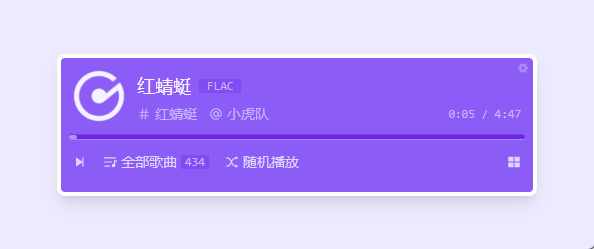

<!--
 * @Author: NMTuan
 * @Email: NMTuan@qq.com
 * @Date: 2022-09-07 16:09:42
 * @LastEditTime: 2022-09-26 11:50:46
 * @LastEditors: NMTuan
 * @Description: 
 * @FilePath: \ezMusic\README.md
-->

## ezMusic

一个简单的前端音频播放器。

## 相关地址

[前端 Demo](https://ezmusic.muyi.dev/)

[文档 Docs](https://www.muyi.dev/ezmusic/)

[源码 GitHub](https://github.com/NMTuan/ezMusic)

## 背景

虽然木耳，但 nas 里还是存了一堆无损音乐。如何随时随地方便的听这些音乐就变成了一个需要解决的问题。[折腾起来。。。](https://www.muyi.dev/ezmusic/causes.html)

## 功能特色

- [x]  随机播放
- [x]  顺序播放
- [x]  单曲循环
- [x]  api配置
- [ ]  音乐淡入淡出
- [ ]  播放列表
- [ ]  歌单管理
- [ ]  专辑管理
- [ ]  歌手管理
- [ ]  更便捷的数据维护
- [ ]  桌面客户端

## 技术架构

选用熟悉的 vue 路线。为了快速上手，使用的是 [nuxt.js v3](https://github.com/nuxt/framework) 版本。目前官方版本为 rc10，相信过不了多久就会发布正式版本了。

除了主要的技术框架外，还用到了以下技术：

- [pinia](https://github.com/vuejs/pinia)：被称作 vuex5 的状态管理

- [unocss](https://github.com/unocss/unocss)：原子 css 引擎

- [sass](https://github.com/sass/sass)：老牌 css 预处理

- [normalize.css](https://github.com/necolas/normalize.css)：统一各浏览器 css 渲染

- [simplebar](https://github.com/Grsmto/simplebar)：现代化的滚动条

- [remixIcon](https://github.com/Remix-Design/RemixIcon)：图标库

## 支持一下

